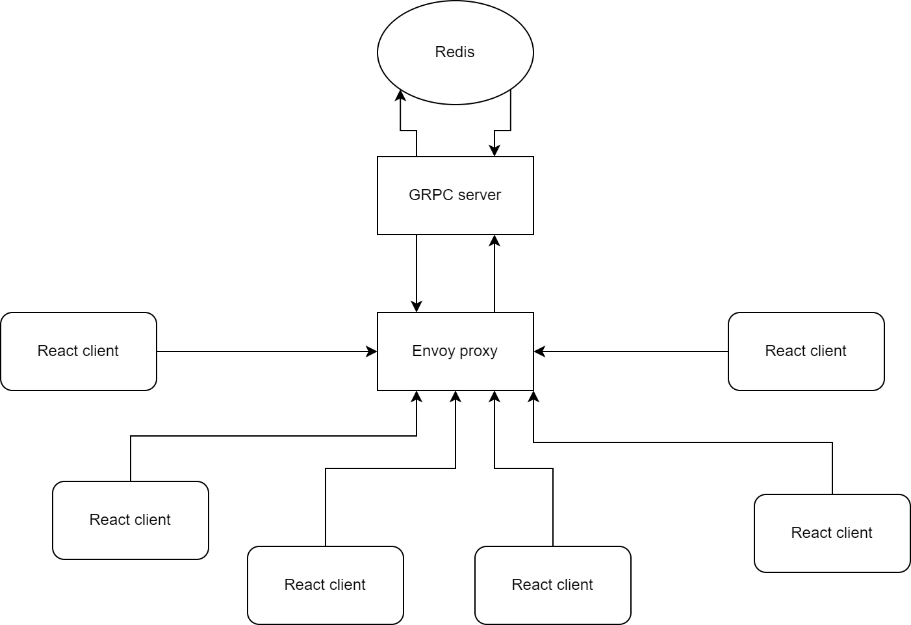
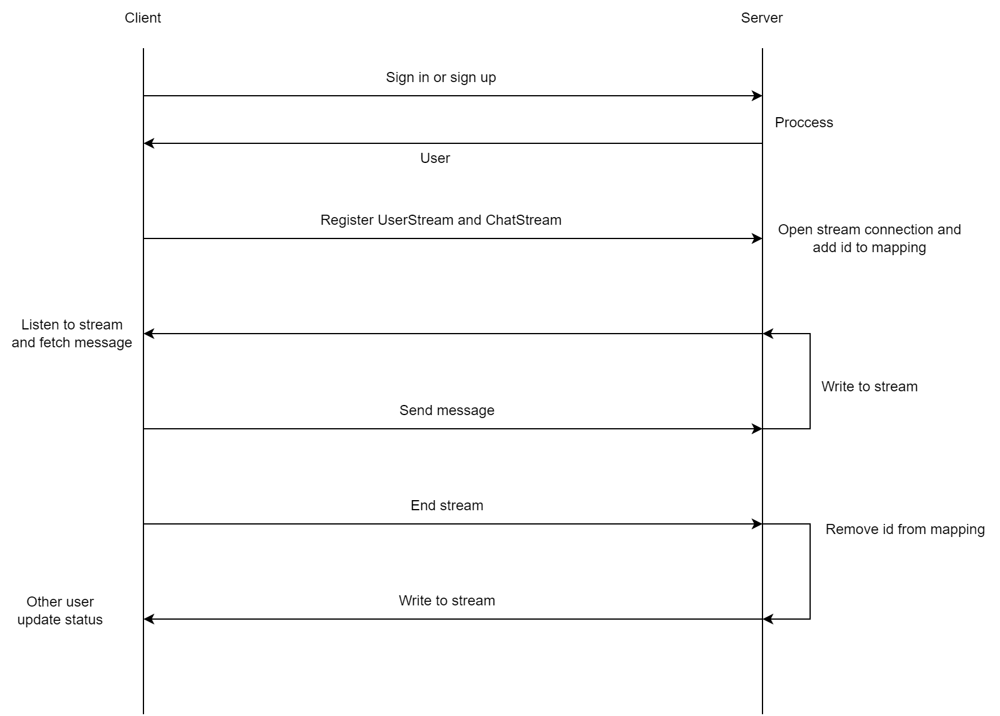

## About me
Name: Lê Thanh Tú
MSSV: 2012709

## About the project
# Video demo: https://youtu.be/vR7CBZHSOLw

# Project structure: 



# Flow:



## Things you need to run this web

1. Node npm/yarn
2. Docker
3. protoc (must include in PATH) - suggest install using choco (Win)

## Project setup

```
docker compose up -d (run envoy and redis)
yarn install
yarn proto:gen
yarn start (start server)
cd client && yarn install
yarn start (start client)
```

## Issue
can run more than 3 client: https://github.com/grpc/grpc-web/issues/344

## Reference
https://www.youtube.com/watch?v=NFZbTy_B4H0
https://www.tutorialspoint.com/redis/redis_lists.htm
https://daily.dev/blog/build-a-chat-app-using-grpc-and-reactjs
https://grpc.io/docs/what-is-grpc/core-concepts/